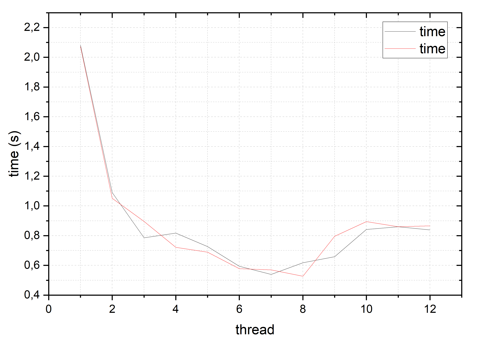

#  Parallelization using pthread API 
## Description
Some program can be speed up using multiple threads of execution. A good example of this speed up can be a calculation of integral using the [Monte Carlo method](https://en.wikipedia.org/wiki/Monte_Carlo_method "Link to wikipedia"). 

This method in this project used to find a integral of non-negative monotonically increasing functions.

## Approach to measure
Util **time** can measure real execution time.   
The **run.sh** script used to run this utility 2 times for each number of threads (1 - 12).

## Results 
**WARNING:** These results were obtained on Ubuntu WSL2

**Processor:** Intel(R) Core(TM) i7-8550U CPU @ 1.80GHz   2.00 GHz
